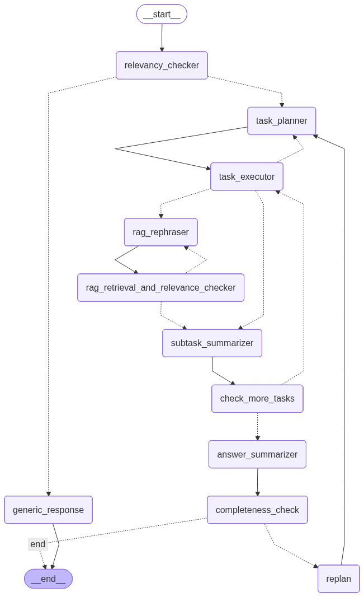
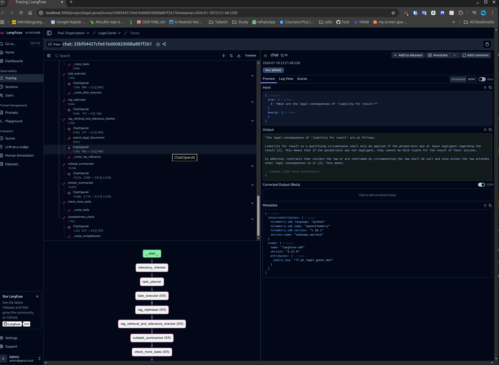

# GenAI based Legal help PwC project

## Issue and Goal of the Application

Hungarian law is rather complex and extensive, covering a wide range of areas, including business, private, and criminal law. It is also difficult for representatives of companies, SMB management, legal aides, and individuals to track relevant information related to this law, especially since they might only need general information on it before seeking an opinion from an attorney.

The purpose of this application is to accelerate this early-stage research by answering these questions briefly and clearly, supported by citations of the respective laws from Hungary. This application works in the English language for international users. The underlying sources and citations are written in the Hungarian language. This application is expected to serve as an ancillary tool for establishing a common level of knowledge and is not intended for obtaining high-level legal advice.

**P.S.: The application was almost fully build from 0, with building every service here, not copying from previous examples of mine.*

## System Architecture

For development and testing, I used an ***NVIDIA RTX 5060TI***.

### Technology Stack & Justifications

| Component | Technology | Justification | Access |
|-----------|------------|---------------|--------|
| **File Storage** | DropBox | Avoids bloating git repo with large PDFs, also easy to integrate. | [Dropbox link](https://www.dropbox.com/scl/fo/s873tup2emf31d6g7rca9/AGJWveXDSn5xc0OtnqkN3Jw?rlkey=uo85e1qxe6as63qf64u1a1uqe&st=da8ncx8y&dl=0) |
| **Document Parsing** | Docling | LangChain-integrated, reliable markdown export, already have experience with it | - |
| **Vector Database** | QDrant | Fast, scalable, Docker-ready with LangChain support | `QDRANT_URL/dashboard` with `QDRANT_API_KEY` |
| **LLM** | Llama-3.1-8B-Instruct-FP8 | Fits VRAM, good quality/speed balance via FP8 quantization | OpenAI-compatible API at `INFERENCE_API_URL` |
| **Monitoring** | Langfuse | Wasn't mandatory, but it helps with tracing and in long term with prompt library. | http://localhost:3000/ with `LANGFUSE_INIT_USER_EMAIL` and `LANGFUSE_INIT_USER_PASSWORD` |
| **Orchestration** | LangGraph | Requirement. | - |
| **UI** | Streamlit | Requirement. | http://localhost:8501/ |

### Agentic Workflow Pipeline




```
START
  ↓
[1] relevancy_checker
  ├── NOT_RELEVANT → generic_response → END
  └── RELEVANT ↓
[2] task_planner
  ↓
[3] task_executor ←─────────────────────────┐
  ├── needs_split → task_planner            │
  ├── search_legal_documents called ↓       │
  │   [4a] rag_rephraser                    │
  │     ↓                                   │
  │   [4b] rag_retrieval_relevance          │
  │     ├── NOT_RELEVANT → rag_rephraser (retry up to 3x)
  │     └── RELEVANT ↓                      │
  ├── calculate_date_difference called ↓    │
  │   (executed directly)                   │
  └─→ [5] subtask_summarizer                │
        ↓                                   │
      [6] check_more_tasks ─────────────────┘
        ├── more tasks? → task_executor
        └── all done ↓
[7] answer_summarizer
  ↓
[8] completeness_check
  ├── COMPLETE → END
  └── INCOMPLETE → [9] replan → task_planner (max 1 replan)
```
The pipeline uses **LangGraph** for stateful, multi-step hybrid agentic workflows with conditional branching and error recovery.

#### Node Descriptions

1. **Relevancy Checker** — Gates questions; routes legal/date questions forward, others get generic response
2. **Task Planner** — Decomposes complex questions into subtasks (max 3); can replan if answer incomplete
3. **Task Executor** — Uses LLM tool calling to decide which tool to invoke:
   - `calculate_date_difference` → date calculation tool (executed directly)
   - `search_legal_documents` → triggers RAG subgraph
4. **RAG Subgraph**:
   - *Rephraser* — Optimizes search query with legal terms/synonyms
   - *Retrieval & Relevance Check* — Fetches chunks from QDrant, validates relevance (retries up to 3x)
5. **Subtask Summarizer** — Summarizes each subtask answer before moving to next task
6. **Check More Tasks** — Loops back if subtasks remain
7. **Answer Summarizer** — Synthesizes all subtask answers with proper citations `[n] Document, Page X, Section Y`
8. **Completeness Check** — Validates answer; triggers replan if incomplete (max 1 replan)

Note: The tool calling Llama [prompt](/deployment/tool_chat_template_llama3.1_json.jinja) is from VLLM's official Llama description with some minor changes.

#### Key Design Decisions

- **Strict RAG routing** — Legal questions never answered from LLM knowledge; always retrieves from documents
- **Adaptive rephrasing** — Up to 3 retry attempts with different query formulations
- **Graceful degradation** — Returns partial results if RAG/replanning fails
- **Streaming support** — UI shows real-time progress through pipeline stages 

## Running the application

> [!CAUTION]
>
> The system was developed and tested on a Linux system (Ubuntu). Cannot guarantee solid running on other environments.

1. Install the required components:

   1. First install the Docker engine & Docker Compose. You can find a description here for that.
   2. Install uv package manager. You can find a description for that here.

2. There are two .env.example files, in the main & in the deployment folder. 

   1. Copy them as .env files.

3. Run the [./deployment/docker-compose.yaml](./deployment/docker-compose.yaml ) file.

**In case the docker compose app is not working properly.**
4. Starting the VLLM inference service and the docker containers.

   ```bash
   sudo docker compose up
   cd deployment
   sh vllm_run.sh
   cd ..
   ```

5. Start the Python environment

   ```bash
   source .venv/bin/activate
   uv sync
   ```

6. Run the init script (it will load the docuemnts to the vector database)

   ```bash
   python init.py
   ```

7. Running the app itself

   ```bash
   streamlit run app.py --server.port 8501
   ```

8. Open the link of the streamlit app.


Tool call template is from official VLLM template with a little twist, I choose this becouse big, but fit into memory, and has tool usage


## Testing

I run a quality and performance test. 

For the testing I used Gemini 2.5 Fast and Thinking.

### Quality test

[Input file](testing/input/quality.csv), [Output file](testing/output/out_quality.csv)
The test notebook is available here: [quality_tests.ipynb](testing/quality_tests.ipynb).
1. I made the question with the Gemini model based on all the documents (which knowed all the docs). All in all it contains 7 simple and 7 complex questions.
2. I measured Correctness (1-5), Fluency (1-5), Relevance (1-5), Coverage(1-5)
3. Because of the limited amount of time, and ~objective results I used LLM as a judge for the test evaluation. 


| Metric      | Mean | Std  | Min | Max |
|-------------|------|------|-----|-----|
| Correctness | 3.00 | 1.41 |  1  |  5  |
| Fluency     | 4.50 | 0.90 |  2  |  5  |
| Relevance   | 3.67 | 1.44 |  2  |  5  |
| Coverage    | 2.92 | 1.51 |  1  |  5  |

These results indicate that while the system performed very well in terms of fluency, there is room for improvement in correctness, relevance, and coverage in its responses.


### Performance test

[Input file](testing/input/performance.csv), [Output file](testing/output/out_performance.csv)
The test notebook is available here: [perfornamce_tests.ipynb](testing/perfornamce_tests.ipynb).
1. For the question generation I used the same method as in the quality test.
2. I run 50 sample simple and complex questions 2 times.
   2.1: 5 item batches (running the queries in a 5 batch query). I choose 5 questions, becouse for this scale it does not seem possible there will be more than 5 concurrent workflow run.
   2.2: Single inference (a single question at a time)

#### Performance results:
| Mode           | Question Type   | Number of Questions | Average Response Time (s) |
|----------------|----------------|---------------------|--------------------------|
| Concurrent     | Complex        | 7                   | 58.586                   |
| Concurrent     | Simple         | 18                  | 37.250                   |
| Sequential     | Complex        | 7                   | 59.637                   |
| Sequential     | Simple         | 18                  | 31.608                   |

* The GPU could easily handle up to 5 questions concurrently, with no noticeable increase in response time—this is likely the current practical maximum.
* Complex questions took 57.3% longer to answer on average compared to simple questions, likely due to requiring more subtasks.

#### Bottleneck analysis:
 * For both qwuestion types I used the longest question generation time.
 * Not surpisingly the longest single node time was the summarization mostly between 10-15 sec.


Simple question (94 sec):
What are the legal consequences of 'liability for result'?
For the answer summarizer task took the longest time to finish, but it run a in multiple splitting route.
I thiunk the question was niot specific enogh, maybe achecker for that would be a good idea.



For the answer summarizer task took the longest time to finish.
Explain the statute of limitations for the punishability of criminal offences.
Unfotunately it didnt find many relevant documents. Probably it would need a better retreival promping and technique.
Complex question (92 sec):


Probably also the issue is that it cannot


### Optimization tips

- Join smaller junks to eachother, in the current solution these are too short without enough context.
- Choose a stronger model with a better GPU
- Choose a stronger embedding (The quality of retrievel was lacking).
- Able to handle documents as input and also handle different users.
- More polished agentic flow and prompts. Because of the limited amount of time I could not make the system more accurate.


## Documents

The following legal documents are currently used in the system:

- Act V of 2013 on the Civil Code.pdf
- Act C of 2012 on the Criminal Code.pdf
- Act CXLIII of 2015 on public procurement.pdf
- Act I of 2012 on the Labor Code.pdf
- Fundamental law.pdf

These do not contain all information about Hungarian law, they are just for representation for now. The Dropbox link will be removed by 2026-02-18.


